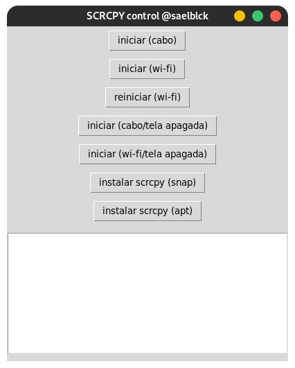

# scrcpy_control
uma janela grafica para controlar com mais facilidade o programa SCRCPY (apenas linux ubuntu/debian)

## descrição
esse script de python é uma janela criada para controlar com mais facilidade o uso do [scrcpy](https://github.com/Genymobile/scrcpy)

ela foi criada e testada no linux baseado em debian, fique a vontade para testar e modificar comom bem entender.

